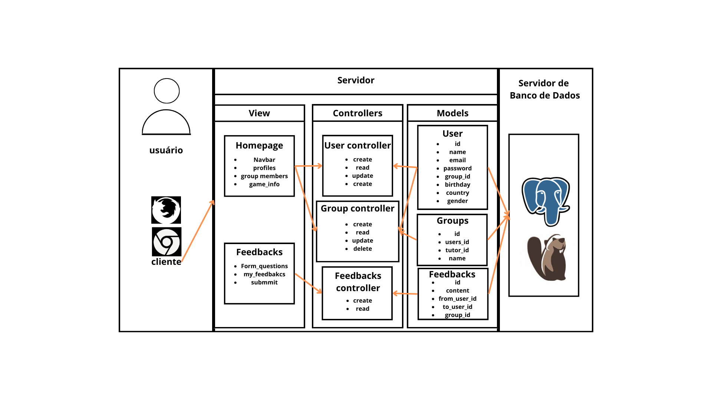

# Design de Arquitetura

# Arquitetura MVC em Markdown
- Nome do Projeto: Code Conecting Cultures
- Descrição: O projeto Code Conecting Cultures é um website fundamentado para que participantes do jogos da Zuyd University possam integrar-se de maneira mais consistente com seus colegas de grupo e tutores. Assim, os estudantes podem criar seus perfis, de modo que forneçam as suas informações e informação sobre seus país. Além disso, àqueles que utilizarem o website também podem enviar e receber feedbacks de seus colegas de time e/ou tutores. 
- Arquitetura: MVC (Model-View-Controller)
- Ferramenta de Diagramação: canva.com

### Modelos (Models):
#### Homepage
- Navbar: barra de navegação para pesquisas dentro da página.
- profiles: perfil dos usuários.
- group_members: membros do grupo do usuário. 
- game_info: informações sobre o jogo, no que se refere ao relacionamento com demais membros e feedbacks do usuários.

#### Feedbacks
- form_questions:perguntas do formulário.
- my_feedbacks: feedbacks recebidos pelo usuário.
- submmit: envio do formulário pelo usuário.

### Controladores (Controllers):
- Liste os controladores do seu projeto e suas responsabilidades.
- Descreva as ações (methods) de cada controlador e seus parâmetros de entrada e saída.
- Explique como os controladores interagem com os modelos e views.

### Views (Views):
- HomePage: Essa é o centro da aplicação, nessa view é mostrado uma navbar com diversas funções, como membros do grupo, tutor, e perfil.

### Infraestrutura:

#### Banco de Dados:
- PostgreSQL: Utilizado como o sistema de banco de dados principal devido à ao fato da ser de código aberto, suas capacidades, confiabilidade e suporte para grandes volumes de dados. A integração com o modelo MVC é feita através dos Models, no qual cada tabela do PostgreSQL possui um correspondente Model no código.

Servidores:
- Servidor de Aplicação Render: Hospeda a lógica de negócios e a interface de usuário. Ele processa as solicitações, executar as operações e entrega os dados já processados para a view.

Dependências:
- Frameworks e Bibliotecas: Utilização do Sails.js no backend para rotas e processamento do banco de dados.

### Justifique as escolhas feitas e como elas impactam o projeto.
#### Implicações da Arquitetura:

Implicações da Arquitetura:
- Escalabilidade: O uso do PostgreSQL permite escalabilidade, essencial com o crescimento do número de usuários e dados. Além disso, a arquitetura MVC facilita a distribuição da carga entre Models, Controllers e Views, e a manutenção do website.

- Manutenção: A separação de responsabilidades para as partes do MVC permite atualizações e manutenções independentes umas das outras, reduzindo efeitos em cadeia de um erro.

- Testabilidade: Dado que cada parte do MVC pode ser independentemente testado, a detecção e resolução de bugs se torna mais ágil.

- Segurança: Utilizar um DBMS como o PostgreSQL garante segurança para os dados do banco.

